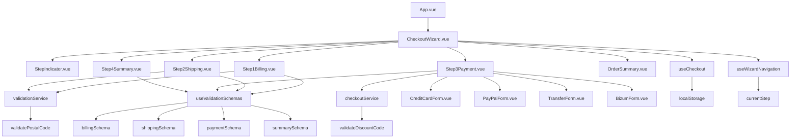

# Arquitectura Técnica

## Diagrama de Componentes



## Flujo de Datos

### 1. Inicialización
```typescript
// CheckoutWizard.vue
onMounted(() => {
  loadFromLocalStorage()  // Recuperar borrador si existe
  startAutoSave()         // Iniciar guardado automático
})
```

### 2. Navegación entre Pasos
```typescript
// Flujo de validación y navegación
const handleNext = (data: any) => {
  // 1. Limpiar errores previos
  errorSummary.value = []
  
  // 2. Guardar datos del paso actual
  saveStepData(currentStep.value, data)
  
  // 3. Persistir en localStorage
  saveToLocalStorage()
  
  // 4. Avanzar al siguiente paso
  nextStep()
  
  // 5. Scroll suave al inicio
  scrollToTop()
}
```

### 3. Validación Asíncrona
```typescript
// Validación de código postal
const onPostalCodeChange = async (code: string) => {
  if (code.length === 5) {
    isValidating.value = true
    
    try {
      const result = await validatePostalCode(code)
      if (result) {
        // Autocompletar ciudad y provincia
        formData.value.city = result.city
        formData.value.province = result.province
      }
    } finally {
      isValidating.value = false
    }
  }
}
```

## Estructura de Archivos

```
src/
├── components/
│   ├── checkout/              # Componentes del wizard
│   │   ├── CheckoutWizard.vue # Componente principal
│   │   ├── StepIndicator.vue  # Indicador de progreso
│   │   ├── Step1Billing.vue   # Datos de facturación
│   │   ├── Step2Shipping.vue  # Dirección de envío
│   │   ├── Step3Payment.vue   # Método de pago
│   │   └── Step4Summary.vue   # Resumen final
│   ├── common/                # Componentes reutilizables
│   │   ├── OrderSummary.vue   # Resumen del pedido
│   │   ├── FormField.vue      # Campo de formulario
│   │   └── DiscountCode.vue   # Código de descuento
│   └── payment/               # Formularios de pago
│       ├── CreditCardForm.vue # Formulario de tarjeta
│       ├── PayPalForm.vue     # Formulario PayPal
│       ├── TransferForm.vue   # Formulario transferencia
│       └── BizumForm.vue      # Formulario Bizum
├── composables/               # Lógica reutilizable
│   ├── useCheckout.ts         # Estado del checkout
│   ├── useValidationSchemas.ts # Esquemas de validación
│   └── useWizardNavigation.ts # Navegación del wizard
├── services/                  # Servicios de API
│   ├── validationService.ts   # Validaciones asíncronas
│   └── checkoutService.ts     # Servicios del checkout
├── types/                     # Definiciones TypeScript
│   ├── checkout.ts            # Tipos del checkout
│   ├── payment.ts             # Tipos de pago
│   └── address.ts             # Tipos de dirección
├── utils/                     # Utilidades
│   ├── creditCard.ts          # Utilidades de tarjetas
│   └── formatters.ts          # Formateadores
└── stores/                    # Estado global (Pinia)
    └── counter.ts             # Store de ejemplo
```

## Patrones de Diseño Utilizados

### 1. Composables Pattern
```typescript
// useCheckout.ts - Lógica reutilizable
export function useCheckout() {
  const billingData = ref<BillingData>({})
  const shippingData = ref<ShippingData>({})
  const paymentData = ref<PaymentData>({})
  
  return {
    billingData,
    shippingData,
    paymentData
  }
}
```

### 2. Factory Pattern (Validaciones)
```typescript
// useValidationSchemas.ts
export const createValidationSchema = (type: string) => {
  switch (type) {
    case 'billing': return billingSchema
    case 'shipping': return shippingSchema
    case 'payment': return paymentSchema
    default: throw new Error('Unknown schema type')
  }
}
```

### 3. Observer Pattern (Eventos)
```typescript
// Comunicación entre componentes
const emit = defineEmits<{
  next: [data: BillingData]
  previous: []
  'validation-error': [errors: string[]]
}>()
```

### 4. Strategy Pattern (Métodos de Pago)
```typescript
// Diferentes estrategias de pago
const paymentStrategies = {
  card: CreditCardForm,
  paypal: PayPalForm,
  transfer: TransferForm,
  bizum: BizumForm
}
```

## Gestión del Estado

### 1. Estado Local (Reactive)
```typescript
// Cada componente maneja su estado local
const formData = ref<BillingData>({
  fullName: '',
  nif: '',
  email: '',
  // ...
})
```

### 2. Estado Compartido (Composables)
```typescript
// useCheckout.ts - Estado compartido entre pasos
const billingData = ref<BillingData>({})
const shippingData = ref<ShippingData>({})
const paymentData = ref<PaymentData>({})
```

### 3. Persistencia (localStorage)
```typescript
// Auto-guardado y recuperación
const saveToLocalStorage = () => {
  const draft = {
    currentStep: currentStep.value,
    billing: billingData.value,
    shipping: shippingData.value,
    payment: paymentData.value,
    timestamp: Date.now()
  }
  localStorage.setItem('checkout-draft', JSON.stringify(draft))
}
```

## Manejo de Errores

### 1. Validación Inline
```typescript
// Errores mostrados bajo cada campo
<span class="error" v-if="errors.fullName">
  {{ errors.fullName }}
</span>
```

### 2. Resumen de Errores
```typescript
// Lista de errores al intentar avanzar
const errorSummary = ref<string[]>([])

const handleValidationError = (errors: string[]) => {
  errorSummary.value = errors
  scrollToFirstError()
}
```

### 3. Scroll Automático
```typescript
const scrollToFirstError = () => {
  setTimeout(() => {
    const firstError = document.querySelector('.error')
    if (firstError) {
      firstError.scrollIntoView({ 
        behavior: 'smooth', 
        block: 'center' 
      })
    }
  }, 100)
}
```

## Optimizaciones de Rendimiento

### 1. Lazy Loading
```typescript
// Carga diferida de componentes
const Step3Payment = defineAsyncComponent(
  () => import('./Step3Payment.vue')
)
```

### 2. Debouncing
```typescript
// Validación con retraso para evitar llamadas excesivas
const debouncedValidation = debounce(validateField, 300)
```

### 3. Memoización
```typescript
// Cache de resultados de validación
const postalCodeCache = new Map<string, PostalCodeData>()
```

### 4. Virtual Scrolling
```typescript
// Para listas largas (si fuera necesario)
<RecycleScroller
  class="scroller"
  :items="items"
  :item-size="54"
  key-field="id"
  v-slot="{ item }"
>
```

## Seguridad

### 1. Validación Client-Side y Server-Side
- Validación en cliente para UX
- Validación en servidor para seguridad

### 2. Sanitización de Datos
```typescript
// Limpieza de datos de entrada
const sanitizeInput = (input: string) => {
  return input.trim().replace(/[<>]/g, '')
}
```

### 3. Encriptación de Datos Sensibles
```typescript
// Los datos de tarjeta nunca se almacenan en localStorage
const sensitiveFields = ['cardNumber', 'cvv']
const shouldPersist = (field: string) => 
  !sensitiveFields.includes(field)
```